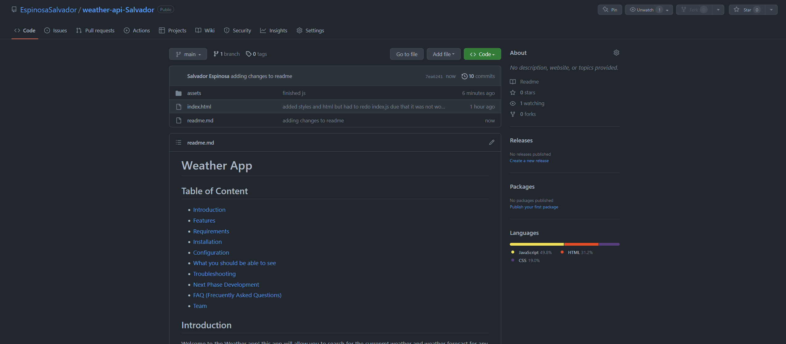
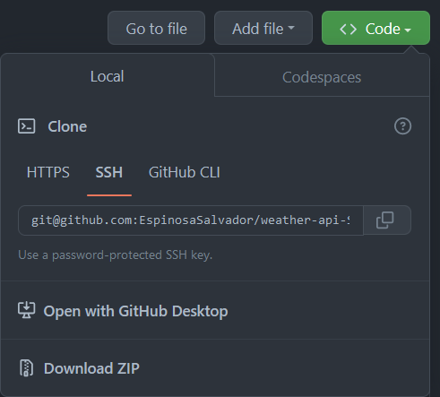
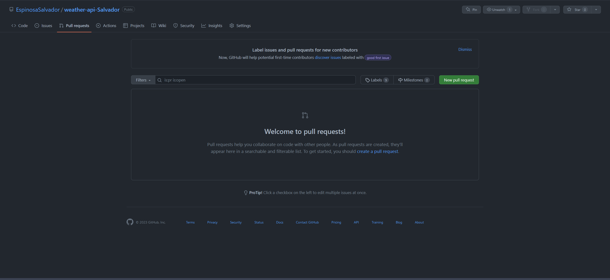
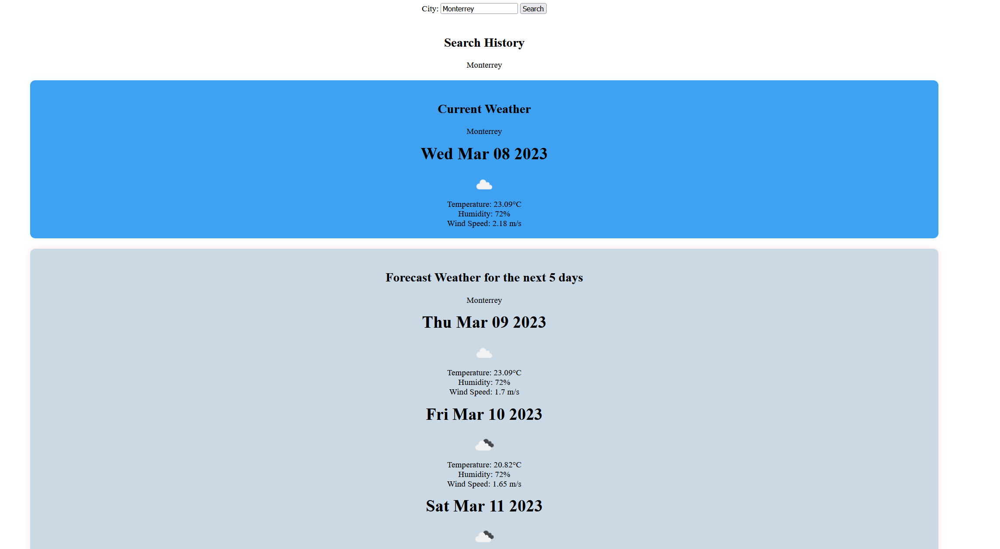
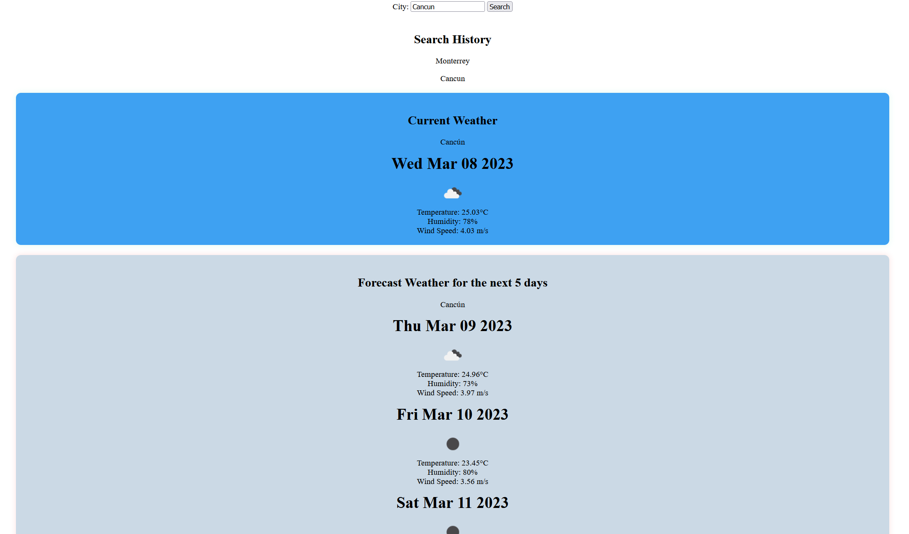

# Weather App

## Table of Content

* [Introduction](#introduction)
* [Features](#features)
* [Requirements](#requirements)
* [Installation](#installation)
* [Configuration](#configuration)
* [What you should be able to see](#what-you-should-be-able-to-see)
* [Troubleshooting](#troubleshooting)
* [Next Phase Development](#next-phase-development)
* [FAQ (Frecuently Asked Questions)](#faq-frecuentrly-asked-questions)
* [Team](#team)

## Introduction

Welcome to the Weather app! this app will allow you to search for the currenmt weather and weather forecast for any citya around the world. the app uses the OpenWeatherMap Api to fetch weather data, and displays the data in an easy to read format.

## Features

* Search for the current weather and weather forecast for any city around the world.
* View the current temperature, humidity, and wind speed for the searched city.
* View the weather forecast for the next 5 days, including the temperature, humidity, and wind speed.
* Search history is saved, allowing you to easily access previously searched cities.

## Requirements

the requirements to run this webpage are really low due that we are only using *HTML*, *CSS* and *JS*.

* Vs code
* GitHub
* Internet
* Download JS to its latest release.

## Installation

To install this project please proceed to my [GitHub Repository](https://github.com/EspinosaSalvador/weather-api-Salvador)

here is the webpage in [Github-Pages](https://espinosasalvador.github.io/weather-api-Salvador/)

you should be able to see this,



Click on code as shown in the image



Copy the SSH key or the HTTPS key and open.

* Terminal
* Git bash
* CMD

either one of this will work. please proceed to the terminal an put in your Terminal,

```
git clone git@github.com:EspinosaSalvador/weather-api-Salvador.git
```

and now you have a copy of the code.

## Configuration

If you want to do any configurations on this project please open a new branch you can do this by putting the following code in your terminal,

```
git checkout -b ＜new-branch＞
```

switch branches putting the following code on your terminal.

```
git checkout ＜branchname＞
```

If you want to show us your code and merge please open a pull request on [Github](https://github.com/EspinosaSalvador/weather-api-Salvador/pulls).



## What you should be able to see

These is what you should be able to see in the Webpage,


Please proceed to text your city that you want to see the weather on. this will be on the top of the page. for this example I am going to use my hometown "Monterrey, MX"



you will see the information for the destination for the current time and the next five days with temperature, windspeed and humidity.

Lets try another city



in cancun we have now new information but the important part is to see that we have everything saved on the search area that is above the current weather.


## Troubleshooting

The Weather app is in version 1.0 ,please let me know if there are anybug in the webpage by issuing it in [Github](https://github.com/EspinosaSalvador/weather-api-Salvador/issues)

## Next Phase Development

This are will be updated depending on the feedback from the users.

## FAQ (Frecuentrly Asked Questions)

We will update this part when we have some frequently asked question.

## Team

* Salvador Espinosa Valdez
